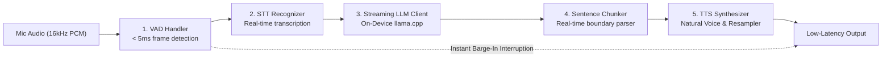

# Speech-to-Speech Mobile

[](#tests) [](#building) [](#layout) [](#backends) [](#licence--compliance)

A high-performance, modular, 100% local on-device Speech-to-Speech conversational engine package designed for mobile devices (Android & iOS) and edge systems.



---

## Documentation

For full architectural specifications, API guides, and integration tutorials, explore the **[docs/](docs/README.md)** portal:

- **[Getting Started Guide](docs/getting-started.md)**: Setup prerequisites, permissions, and minimal Activity setup.
- **[Architecture & Turn State Machine](docs/architecture.md)**: Conceptual pipeline, thread model, and turn states.
- **[Configuration Reference](docs/configuration.md)**: Complete parameter guide for VAD, ASR, LLM, TTS, and Audio.
- **[API Overview](docs/api/overview.md)**: Package structure and `S2SEvent` sealed event hierarchy.
- **[Public Classes Reference](docs/api/classes.md)**: Specifications for `S2SEngine`, `ModelDownloader`, `ChatHistory`, etc.
- **[Pipeline Interfaces](docs/api/interfaces.md)**: Abstractions for custom stage implementations (`AudioInput`, `SpeechRecognizer`, `LanguageModel`, `SpeechSynthesizer`).
- **[Performance & Thermal Profiling](PERFORMANCE_AND_PROFILING.md)**: Memory footprint, thread budgeting, and battery benchmarks.
- **[Privacy & Permissions Guide](PRIVACY_AND_PERMISSIONS.md)**: On-device privacy, Play Store Data Safety, and license compliance.

## Layout

```
bindings/android/          the SDK — an Android library, publishable as an AAR
  pipeline/                stage interfaces: AudioInput/Output, SpeechRecognizer,
                           LanguageModel, SpeechSynthesizer, TextChunker, Tools
  config/                  per-stage configuration
  audio/  vad/  stt/       implementations, one package per stage
  llm/    tts/  text/
  tools/  internal/
examples/android-demo/     minimal harness: one button, a transcript
```

Every stage sits behind an interface, so swapping Kokoro for Piper or the streaming recogniser for an offline one is a constructor argument:

```kotlin
val engine = S2SEngine(
    context = this,
    config = S2SConfig(models = ModelPaths(...)),
    synthesizer = MyOwnSynthesizer(),   // optional override
)
engine.initialize().getOrThrow()        // slow, call off the main thread
engine.start()

lifecycleScope.launch {
    engine.events.collect { event ->
        when (event) {
            is S2SEvent.UserTranscript -> ...
            is S2SEvent.AssistantDelta -> ...
            is S2SEvent.Metrics -> ...
            else -> Unit
        }
    }
}
```

`RECORD_AUDIO` must be granted before `start()`.

## Backends

| Stage | Implementation | Alternatives available |
|-------|----------------|------------------------|
| VAD   | Silero VAD v5 (ONNX) | — |
| STT   | Streaming Zipformer transducer | Zipformer2-CTC, Paraformer, NeMo-CTC |
| LLM   | llama.cpp via Llamatik, any GGUF | — |
| TTS   | Kokoro-82M, 24 kHz | VITS/Piper, Matcha, Kitten, Pocket |

Kokoro and Pocket match the `kokoro` and `pocket` backends in the Python pipeline; Paraformer matches `paraformer`.

## Building

```bash
./gradlew :examples:android-demo:assembleDebug
adb install -r examples/android-demo/build/outputs/apk/debug/android-demo-debug.apk
```

sherpa-onnx resolves from JitPack, which `settings.gradle.kts` declares. Anyone consuming this SDK needs that repository too:

```kotlin
repositories {
    maven { url = uri("https://jitpack.io") }
}
```

The demo downloads its models on first run into `Android/data/com.s2s.demo/files/models/`. To side-load them instead:

```
models/silero_vad.onnx      Silero VAD v5
models/stt/                 extracted sherpa streaming ASR bundle
models/tts/                 extracted sherpa TTS bundle
models/model.gguf           any instruct-tuned GGUF
```

## Latency & Performance

Measured per turn from the end of the user's speech and logged as `turn latency: first token Xms, first audio Yms`.

Recognition runs *while* the user is speaking, so the transcript is already decoded when the endpointer fires — there is no transcription wait in the response path. Generation is chunked at clause boundaries so the first phrase is synthesised while the rest is still being written.

For full battery discharge rates, CPU thermal profiling, and memory footprint benchmarks during sustained multi-minute sessions, see **[PERFORMANCE_AND_PROFILING.md](PERFORMANCE_AND_PROFILING.md)**.

## Tests

```bash
./gradlew :bindings:android:testDebugUnitTest
```

## Licence & Compliance

This project is published under the [Apache License 2.0](LICENSE). 

For full privacy guarantees, Android runtime permissions, Play Store Data Safety guidelines, and open-source license compliance audit details, see **[PRIVACY_AND_PERMISSIONS.md](PRIVACY_AND_PERMISSIONS.md)**.

**Before you ship an app built on this SDK, read [NOTICE](NOTICE).** Our own source is Apache-2.0, and `llama.cpp`/Llamatik is MIT, but the speech library we link against — `libsherpa-onnx-jni.so` — has **espeak-ng compiled into it**, and espeak-ng is **GPL-3.0**. Distributing that binary means distributing GPL-3.0 code, whichever text-to-speech model you select, because they all live in the same library.

Verified in the shipped binary: espeak-ng's own data-file names (`phondata`, `phontab`, `phonindex`, `intonations`) and the source string `"Could not load the mbrola.dll file"`. Every Piper and Kokoro bundle also ships an `espeak-ng-data/` directory.

Tracked in [#27](https://github.com/loyality7/speech-to-speech-mobile/issues/27). sherpa-onnx is removing espeak-ng in 2.0.0 ([k2-fsa/sherpa-onnx#3731](https://github.com/k2-fsa/sherpa-onnx/pull/3731)), which will resolve this at the source; until then this is an open question for anyone shipping closed-source.

**Model licensing**: models are downloaded at runtime and carry their own licences. See [NOTICE](NOTICE).
