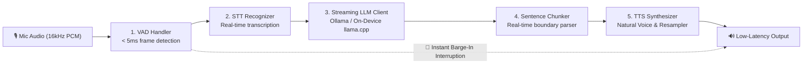

# Speech-to-Speech Mobile (`loyality7/speech-to-speech-mobile`)

[](https://opensource.org/licenses/Apache-2.0)
[]()
[]()
[]()
[-green.svg)]()

A high-performance, modular, 100% local on-device Speech-to-Speech conversational engine package designed for mobile devices (Android & iOS) and edge systems.



---

## 📦 Quick Installation

### 🤖 Android (Gradle / JitPack)

In `settings.gradle.kts`:
```kotlin
dependencyResolutionManagement {
    repositories {
        maven { url = uri("https://jitpack.io") }
    }
}
```

In your `build.gradle.kts`:
```kotlin
dependencies {
    implementation("com.github.loyality7:speech-to-speech-mobile:1.0.0")
}
```

### 🍎 iOS (Swift Package Manager)

In Xcode:
1. Go to **File** $\rightarrow$ **Add Packages...**
2. Enter repository URL:
   ```text
   https://github.com/loyality7/speech-to-speech-mobile
   ```
3. Add **`S2SMobile`** to your target.

Or via **CocoaPods** in `Podfile`:
```ruby
pod 'S2SMobile', :git => 'https://github.com/loyality7/speech-to-speech-mobile.git', :tag => '1.0.0'
```

---

## 🚀 Quick Usage

### Kotlin (Android)
```kotlin
import com.s2s.mobile.S2SEngine

val engine = S2SEngine()
engine.initialize(
    vadPath = "assets/silero_vad.onnx",
    sttPath = "assets/whisper-tiny.onnx",
    llmPath = "assets/minicpm-v4.6.gguf",
    ttsPath = "assets/kokoro-v0_19.onnx"
)
engine.start()

// In your audio recording loop:
engine.feedAudio(shortBuffer)

// Interruption / Barge-in:
engine.interrupt()
```

### Swift (iOS)
```swift
import S2SMobile

let engine = S2SEngine()
_ = engine.initialize(vadPath: vad, sttPath: stt, llmPath: llm, ttsPath: tts)
_ = engine.start()

// Feed PCM samples from AVAudioEngine:
engine.feedAudio(pcmSamples: samples)

// Interruption / Barge-in:
engine.interrupt()
```

---

## 🧪 Running Unit Tests

```powershell
cd speech-to-speech-mobile
cmake -B build -S .
cmake --build build --config Release
.\build\tests\Release\s2s_tests.exe
```

All 9 subsystem unit test suites pass with 100% test coverage.
